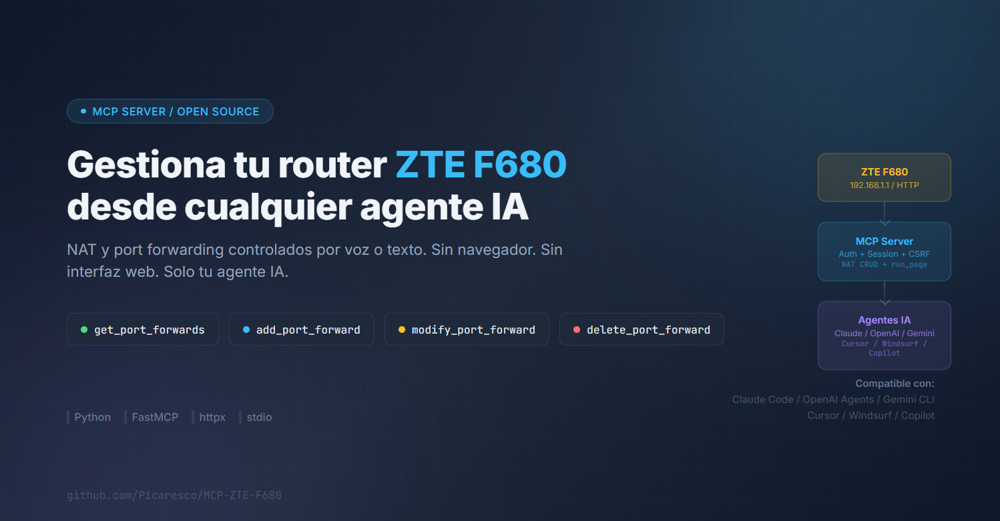

# zte-f680-mcp

<p align="center">
  
</p>

MCP Server ([Model Context Protocol](https://modelcontextprotocol.io)) to manage **NAT / port forwarding** on a **ZTE ZXHN F680** GPON router from any MCP-compatible client (Claude Desktop, Claude Code, Cursor, Windsurf, OpenAI Agents SDK, Cline, Continue, etc.).

> Control your router port forwarding rules conversationally, without opening the web UI.

## Features

| Tool | Description |
|---|---|
| `zte_get_port_forwards` | List all NAT rules |
| `zte_open_port` | **Quick-open a port** with smart defaults (auto-detect local IP, same port both sides) |
| `zte_get_local_ip` | Return the host IP in the router's subnet (cross-platform) |
| `zte_add_port_forward` | Add a rule with full control (ranges, custom internal IP/port) |
| `zte_modify_port_forward` | Modify an existing rule by index |
| `zte_delete_port_forward` | Delete a rule by index |
| `zte_run_page` | Fetch and parse any page from the router (generic) |

### Quick-open flow (v0.2.0+)

Ask your assistant plainly and it will confirm before touching the router:

> **You:** open port 8080
> **Assistant:** Your local IP is `192.168.1.128`. Should I forward `8080 → 192.168.1.128:8080`?
> **You:** yes
> **Assistant:** ✓ Rule added.

Under the hood the assistant calls `zte_get_local_ip` (to pick the correct interface even on multi-homed hosts) and then `zte_open_port(port=8080)`. If you want a different internal port or IP, just say so and the assistant switches to `zte_add_port_forward` with your values.

## Requirements

- Python **3.10+**
- A **ZTE ZXHN F680** router reachable on the local network
- The **admin credentials** of the router's web panel

## Install & configure

The easiest way is with [`uv`](https://docs.astral.sh/uv/) (or `pipx`). No cloning, no venv.

### Claude Desktop

Edit `claude_desktop_config.json`:

- **macOS**: `~/Library/Application Support/Claude/claude_desktop_config.json`
- **Windows**: `%APPDATA%\Claude\claude_desktop_config.json`

```json
{
  "mcpServers": {
    "zte": {
      "command": "uvx",
      "args": ["zte-f680-mcp@latest"],
      "env": {
        "ZTE_HOST": "192.168.1.1",
        "ZTE_USER": "1234",
        "ZTE_PASSWORD": "your_password_here"
      }
    }
  }
}
```

> **Tip**: `@latest` makes `uvx` check PyPI on every launch and use the newest version, so users get updates automatically. Remove `@latest` (just `"zte-f680-mcp"`) to pin to whatever was installed first.

### Claude Code (CLI)

```bash
claude mcp add zte \
  --env ZTE_HOST=192.168.1.1 \
  --env ZTE_USER=1234 \
  --env ZTE_PASSWORD=your_password_here \
  -- uvx zte-f680-mcp@latest
```

### Cursor / Windsurf / Cline / Continue

Add the same block as Claude Desktop in the corresponding MCP settings file of each client.

### OpenAI Agents SDK (Python)

```python
from agents.mcp import MCPServerStdio

zte = MCPServerStdio(
    params={
        "command": "uvx",
        "args": ["zte-f680-mcp@latest"],
        "env": {
            "ZTE_HOST": "192.168.1.1",
            "ZTE_USER": "1234",
            "ZTE_PASSWORD": "your_password_here",
        },
    }
)
```

### Upgrading existing installs

If you registered the server before and want to jump to the newest release:

```bash
# Option 1: force-refresh the cache
uvx --refresh zte-f680-mcp

# Option 2: wipe the cache for this package only
uv cache clean zte-f680-mcp
```

After this, the next time your MCP client launches the server, `uvx` will fetch the latest version.

### Alternative: classic pip install

```bash
pip install --upgrade zte-f680-mcp
```

Then point your MCP client at the installed script:

```json
{
  "mcpServers": {
    "zte": {
      "command": "zte-f680-mcp",
      "env": {
        "ZTE_HOST": "192.168.1.1",
        "ZTE_USER": "1234",
        "ZTE_PASSWORD": "your_password_here"
      }
    }
  }
}
```

## Configuration

The server reads three environment variables (or a local `.env` file):

| Variable | Default | Description |
|---|---|---|
| `ZTE_HOST` | `192.168.1.1` | Router IP |
| `ZTE_USER` | `1234` | Admin username |
| `ZTE_PASSWORD` | _(none)_ | Admin password (required) |

## Example prompts

Once the MCP is registered you can ask your assistant things like:

```
List the NAT rules on my ZTE router
Open TCP port 8080 forwarded to 192.168.1.100
Delete port forwarding rule number 2
Show the DHCP leases from my router
```

## How it works

- **Auth**: `SHA256(password + random)` with dynamic tokens (`Frm_Logintoken`, `Frm_Loginchecktoken`) extracted from the login page.
- **Session**: Expires ~60 s idle. The server re-authenticates automatically every 45 s.
- **Anti-CSRF**: Each write operation requires a fresh `_SESSION_TOKEN` fetched from the page.
- **Protocol codes**: `0` = TCP+UDP, `1` = UDP, `2` = TCP.
- **Transport**: MCP over `stdio`.

## Stack

- [FastMCP](https://github.com/modelcontextprotocol/python-sdk) (`mcp[cli]`)
- [httpx](https://www.python-httpx.org/) (async HTTP client)
- [python-dotenv](https://github.com/theskumar/python-dotenv)
- [pydantic](https://docs.pydantic.dev/)

## Development

```bash
git clone https://github.com/Picaresco/MCP-ZTE-F680.git
cd MCP-ZTE-F680
python -m venv venv && . venv/Scripts/activate   # Windows
# source venv/bin/activate                         # Linux / macOS
pip install -e .
cp .env.example .env   # fill in your credentials
python -m zte_f680_mcp.server
```

## License

[MIT](LICENSE) &copy; Alberto Diaz
